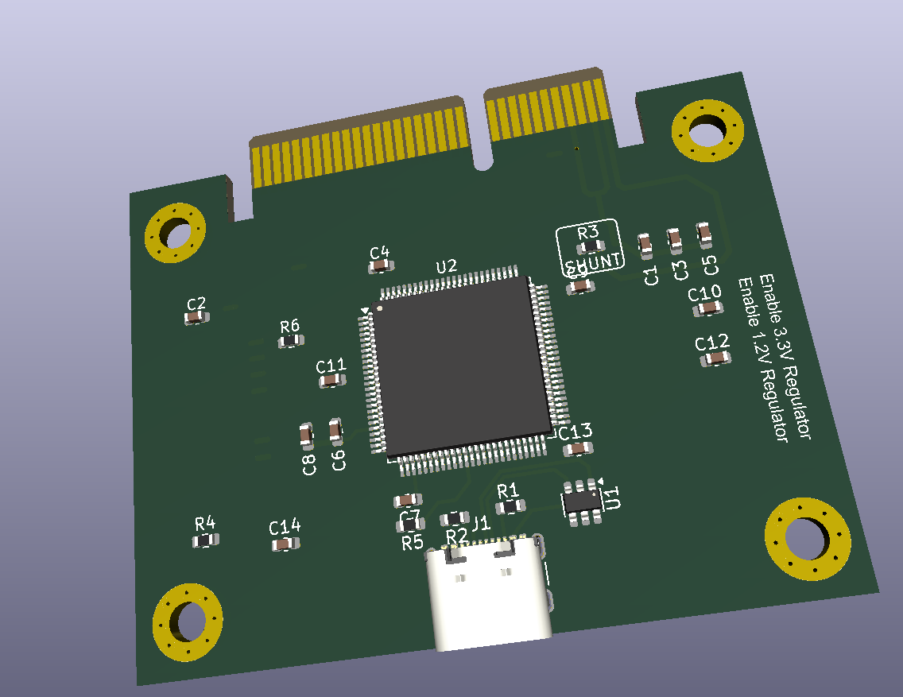
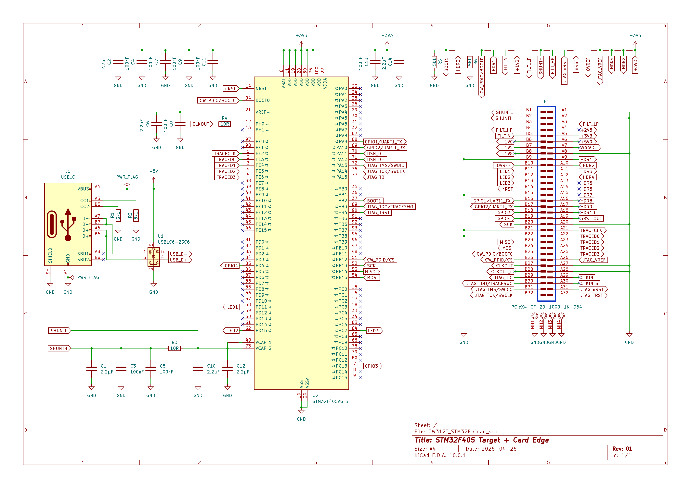

# CW312T-STM32F

This board supports the STMicroelectronics STM32F microcontroller. The default build
has the STMicroelectronics STM32F405VGT6, which has 1MB flash and 192kB SRAM.

\---

## Specifications

|Feature|Notes/Range|
|-|-|
|Target Device|STM32F|
|Target Architecture|Arm Cortex-M4|
|Vcc|3.3V|
|Programming|Bootloader or JTAG|
|Hardware Crypto|No|
|Availability|Standalone|
|Status|Released|
|Shunt|10Ω|

## Power Supply

\---

## Programming

### **ChipWhisperer Programmer via Bootloader**

See further down this page for details.

### **JTAG Programmer**

The 20-pin JTAG port (J6 on CW308 Board) can be used with the
[ST-LINK/V2](https://www.digikey.com/product-detail/en/stmicroelectronics/ST-LINK-V2/497-10484-ND/2214535)
which is a low-cost JTAG programmer.

It is also possible to use other JTAG programmers such as OpenOCD. The
following command worked with an Olimex OpenOCD programmer and their
[OpenOCD for
Windows](https://www.olimex.com/Products/ARM/JTAG/ARM-USB-OCD-H/)
software:

    openocd
      -f path/to/board/files/cw308.cfg
      -c init
      -c targets
      -c "halt"
      -c "flash write_image erase path/to/firmware.hex"
      -c "verify_image path/to/firmware.hex"
      -c "reset run"
      -c shutdown

where the contents of `cw308.cfg` are

    source [find interface/olimex-arm-usb-ocd-h.cfg]
    source [find target/stm32f4x.cfg]
    reset_config srst_only

\---

## Schematic

The schematic is available as a [PDF](CW312T-STM32F.pdf) or below as an image:

\---

